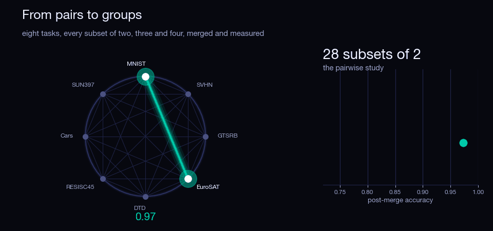

# Can Mergeability Be Predicted Without Data?
**_And does pairwise mergeability carry over to groups?_**



Fine-tuned models can be merged by averaging their weights — sometimes for free, sometimes catastrophically. *Demystifying Mergeability* predicts which, but its strongest signal is **gradient alignment**, which needs calibration data. We ask what survives using **only the weights**, and whether mergeability measured on pairs carries over to groups of three and four.

📄 **Target paper:** [Demystifying Mergeability](https://arxiv.org/abs/2601.22285) (Zhou, Zhao, Yu, Rodolà, ICML 2026). Both questions are open problems named in its Appendix A.1.

## What we found

Two CLIP backbones · 8 tasks · every one of the 154 subsets · 3 merge methods · 462 merges each.

| | ViT-B/32 | ViT-B/16 |
|---|---|---|
| Data-free power retained, k = 2 / 3 / 4 | 106% / 110% / 106% | 92% / 101% / 94% |
| Dropping the data changes nothing (paired bootstrap) | 9 / 9 | 9 / 9 |
| Beats both permutation nulls, k = 2 / 3 / 4 | 3/3 · 3/3 · 3/3 | 1/3 · 3/3 · 3/3 |
| Pairwise structure carries to k-way | 6 / 6 | 5 / 6 |
| Many metrics beat the best single one | 7 / 9 | 7 / 9 |
| `grad_cosine` agrees with itself at 10 vs 100 samples | −0.15 | −0.50 |

**The calibration data buys nothing.** Dropping all seven activation and gradient metrics leaves prediction statistically unchanged in all nine settings, on both backbones — and giving them ten times more calibration data does not rescue them.

**Because at the paper's budget, the gradient metrics are noise.** At 10 samples per task, `grad_cosine` is *anti-correlated* with its own 100-sample value on both backbones. That is the mechanism behind the first result, not a coincidence.

**Pairs do predict groups**, beyond an additive per-task baseline, in 11 of 12 settings across the two backbones.

**Twenty-eight pairs is not enough.** k = 2 is where both backbones are weakest, and the n-matched control cannot separate "pairs are harder" from "there are fewer of them".

## Repository
core modules:

```
src/
  utils.py       state_dict algebra: task vectors, flatten, subsets
  config.py      configs/*.yaml -> one Config object
  backends.py    where models come from: synthetic | CLIP
  metrics/       geometry, rank, subspace (data-free) + functional (not)
  merging.py     weight averaging, task arithmetic, TIES
  pipeline.py    metrics + merges + accuracies -> two CSVs
  predict.py     L1 fit, leave-one-task-out CV, nulls, bootstrap
  experiments/   e0..e5
  viz.py         figure generation
scripts/         one runner per experiment
configs/         the experimental setup lives here
artifacts/       cached results, one directory per backend
figures/
```

Every function takes a **list** of task vectors, never a pair, which is what makes the k-way question cheap to answer.

## Run

```bash
uv sync
```

Everything — e0 to e5 at every k, the density sweep, the calibration study, the six statistical checks and all ten figures:

```bash
uv run python scripts/run_all.py                    # synthetic harness, ~7 min
uv run python scripts/run_all.py --backend clip     # ViT-B/32, the real benchmark
uv run python scripts/run_all.py --backend clip16   # ViT-B/16, the replication
```

Add `--quick` to skip the density sweep, the calibration study and the statistical checks.

<details>
<summary><b>Or step by step</b></summary>

```bash
uv run python scripts/run_e0.py --backend clip   # sanity: checkpoints load, fine-tuning helped
uv run python scripts/run_e1.py --backend clip   # ground truth: metrics + merges + accuracies
uv run python scripts/run_e2.py --backend clip   # RQ1: data-free vs full predictor
uv run python scripts/run_e3.py --backend clip   # which metrics matter, and is that reproducible
uv run python scripts/run_e4.py --backend clip   # RQ2: does pairwise predict k-way?
uv run python scripts/run_e5.py --backend clip   # null baselines + bootstrap intervals
uv run python scripts/make_figures.py --backend clip
```

The TIES density sweep and the calibration study:

```bash
uv run python scripts/run_density_sweep.py --backend clip --k 2
uv run python scripts/analyze_density_sweep.py --backend clip
uv run python scripts/analyze_calibration.py --backend clip --k 2
```

The six checks behind the reported claims:

```bash
for c in global_test paired_bootstrap univariate nmatched pooled_k increment_null; do
    uv run python scripts/analyze_$c.py --backend clip
done
```

Every script also takes `--backend clip16` and `--backend synthetic`.

</details>

## Three backends

`synthetic` generates tiny models and runs the whole pipeline in seconds, so every stage is verified before any GPU time is spent. It is the **test harness, not a source of findings**.

`clip` is the experiment: CLIP ViT-B/32 encoders fine-tuned on eight image classification tasks, released by [Task Arithmetic](https://github.com/mlfoundations/task_vectors).

`clip16` is the same benchmark on CLIP ViT-B/16, used to check that the conclusions survive a change of backbone.

Each backend reads its own section of `configs/tasks.yaml` and writes to its own `artifacts/<backend>/`, so the two runs cannot overwrite each other. Every run records a `run_info.csv`, and every analysis refuses to load results produced under a different backend or task count.

## Reading the numbers

With this few task pairs, the fitting procedure alone reaches r ≈ 0.5 on pure noise. **Every reported correlation carries two null baselines and a bootstrap interval** — a bare correlation is not interpretable here.

Three things to know before quoting any figure:

- **The activation and gradient metrics are computed on the evaluation loader**, the same images the merged models are scored on. That is a leak, and it favours the data-dependent set. The finding is that dropping those metrics costs nothing, so the leak makes that conclusion conservative rather than optimistic.
- **`samples_per_task: 10` is the paper's calibration budget**, not a tuned choice. `analyze_calibration.py` re-derives every metric at 100 samples and reports both. The data-free columns must come out bit-identical between the two runs or the script refuses to compare them.
- **Never quote the naive pooled correlation.** Merges get worse as k grows, so pooling all k together lets a predictor score well by detecting subset size. `analyze_pooled_k.py` reports the within-k standardised value beside it; the gap reaches 0.33 on this benchmark.

## Reproducing the reported numbers

The results behind the report are committed under `artifacts/clip/` and `artifacts/clip16/`, so every number can be read directly without regenerating anything. Each directory carries a `run_info.csv` recording the backend, model, task list, subset count and seed that produced it.

To regenerate instead, check out the commit cited in the report, obtain the checkpoints below, and run `run_all.py`. Expect 154 subsets (28 pairs, 56 triples, 70 quads) across 8 tasks and 3 merge methods.

## Getting the checkpoints

The CLIP backends need eight fine-tuned encoders plus the zero-shot model, from the Task Arithmetic release:

<https://drive.google.com/drive/folders/1u_Tva6x0p6oxu5Eo0ZZsf-520Cc_3MKw>

Download the `ViT-B-32` folder (and `ViT-B-16` for the replication). The files are pickled `ImageEncoder` objects, so convert them to plain state dicts once:

```bash
uv run python scripts/download_checkpoints.py --list
uv run python scripts/download_checkpoints.py --convert /path/to/ViT-B-32
uv run python scripts/download_checkpoints.py --backend clip16 --convert /path/to/ViT-B-16
```

Test images are fetched automatically: MNIST, SVHN, GTSRB, EuroSAT and DTD from torchvision, RESISC45, Cars and SUN397 from the `tanganke/*` HuggingFace mirrors.
